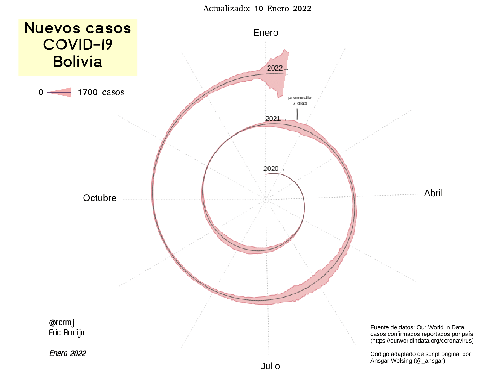

# Nuevos casos COVID-19 en Bolivia

Datos de casos confirmados para Bolivia obtenidos de [Our World in Data](https://ourworldindata.org/coronavirus), acceso API mediante código. 

[Código fuente R](ny_corona_spiral_chart_Bolivia.R)

Gráfico creado en R de la adaptación de código desarrollado por Ansgar Wosling [@_ansgar](https://bydata.github.io/nyt-corona-spiral-chart/)

Diseño final (leyenda y edición de algunas etiquetas) en LibreOffice Impress.

---

## Gráfico

