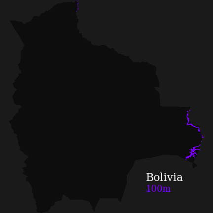

# Animación de elevación en Bolivia
Visualización de la distribución de curvas de elevación para Bolivia. 

### Datos fuentes incluidos

| Archivo             |  Descripción |
:-------------------------:|:-------------------------:
bolivia.shp  |  Límite internacional de Bolivia
bolivia_contours_100.shp  |  Líneas de contorno, cada 100 metros

[Código fuente Jupyter Notebook](Elevacion_arcoiris_Bolivia.ipynb)
Jupyter Notebook adaptado de un script desarrollado por Jessica Roberts (@GeospatialJ)
 
[Script original de referencia](https://github.com/jess-roberts/rainbow-elevation-gif)

---

## Gráfico

