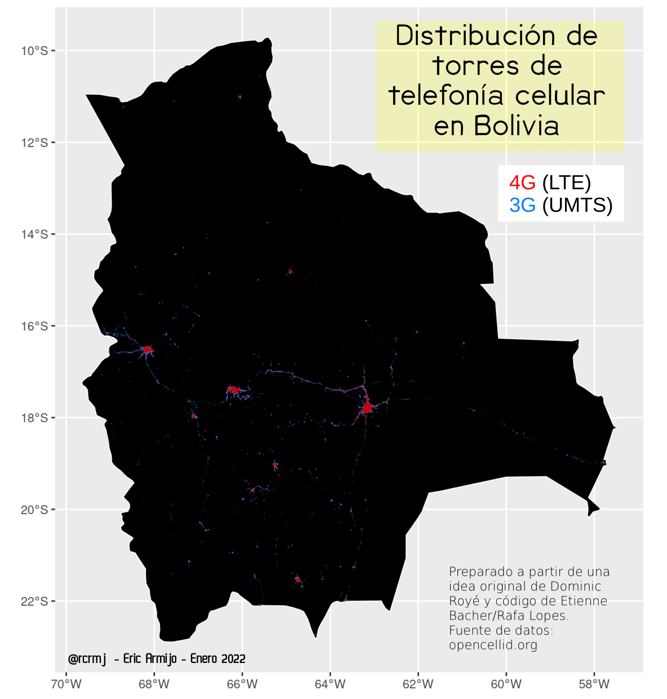

# Distribución de torres de telefonía celular en Bolivia

[Datos fuente](736.csv.gz)

Representación de ubicación de torres de telefonía celular a partir de datos abiertos (opencellid.org)

[Código fuente R](torres_celular_Bolivia.R)

Gráfico creado en R a partir de código desarrollado por @EtienneBacher / Rafael Lopes [@rafalpx](https://github.com/rafalopespx/cell_towers_br)

Diseño final en LibreOffice Impress.

---

## Mapa

