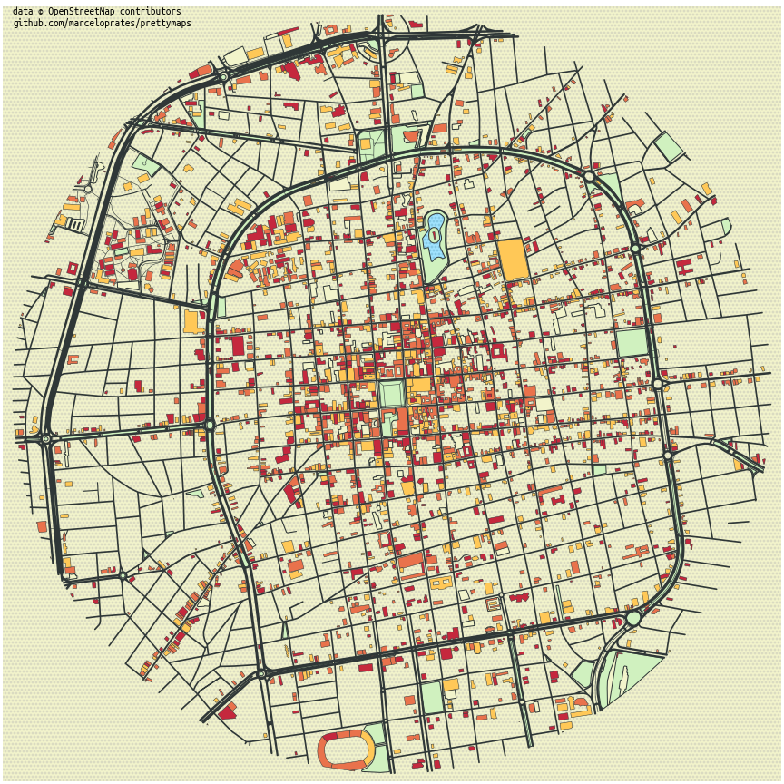
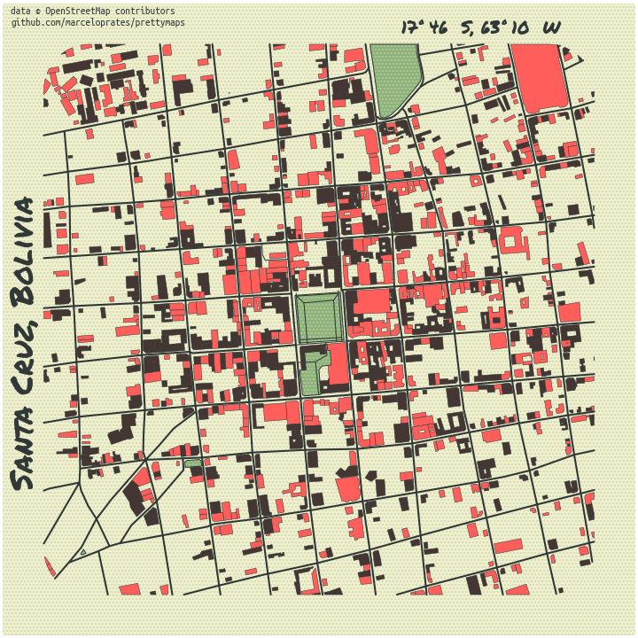

# Mapas bonitos de una ciudad a partir de OpenStreetMap
Representación de elementos urbanos del centro de una ciudad de Bolivia.

### Código fuente

[Estilo 1: Jupyter Notebook](prettymaps_santacruz_estilo1.ipynb)

[Estilo 2: Jupyter Notebook](prettymaps_santacruz_estilo2.ipynb)

Código Python adaptado de ejemplos provistos por el autor, Marcelo Prates (@marceloprates_)

[Sitio web original de referencia](https://github.com/marceloprates/prettymaps)

---

### Gráficos

| Nombre             |  Mapa |
:-------------------------:|:-------------------------:
Estilo 1  |  
Estilo 2  |  
